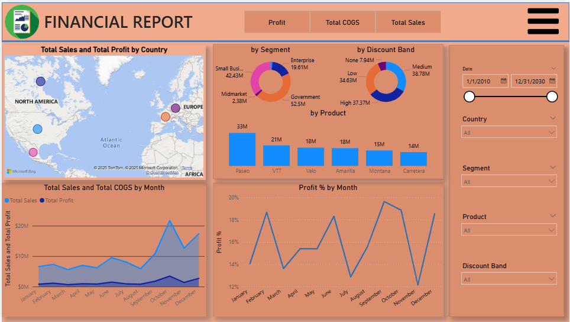
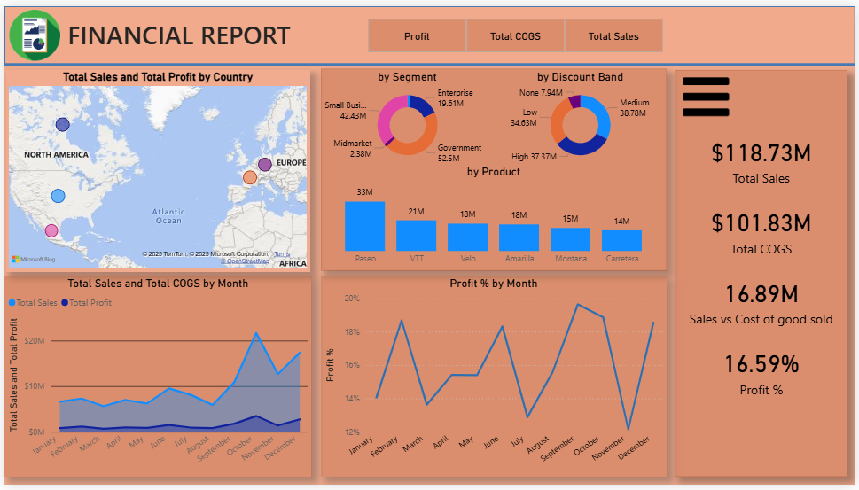

# Power BI Dashboard: Financial Report with Bookmarks

This project is an **interactive Power BI dashboard** built while learning through a **Udemy online course**.  
The course guided the base dashboard creation, and I enhanced it by adding **Bookmarks** and **Field Parameters** for interactivity.

---

## 📊 Dashboard Preview

### 🔖 Bookmark - Slicer Panel

### 🔖 Bookmark - KPI Cards

---

## 🎯 Project Objectives
- Learn how to use **Bookmarks** in Power BI to create interactive elements such as slicer panels and KPI cards.
- Explore **Field Parameters** to dynamically switch between different measures (Profit, Total COGS, Total Sales).
- Build a clean and functional financial report dashboard.

---

## ✨ Features
- **Bookmarks Interactivity**
  - Clicking the top three-dots button reveals the slicer panel.
  - Clicking the bottom three-dots button displays KPI cards (Total Sales, Total COGS, Profit %).
- **Dynamic Measures with Field Parameters**
  - Toggle between **Profit**, **Total COGS**, and **Total Sales** at the top of the dashboard.
- **Visualizations**
  - Sales & Profit by Country (Map)
  - Segment & Discount Band Analysis (Donut Charts)
  - Sales by Product (Bar Chart)
  - Monthly Trends for Sales, COGS, and Profit %
- **Clean UI** with simple navigation.

---

## 📈 Insights
- **Geographical Performance**: North America and Europe are the strongest contributors to sales and profit.  
- **Customer Segments**: Government and Enterprise dominate total sales.  
- **Discount Band Impact**: Most sales occur in Medium and High discount bands.  
- **Monthly Trends**: Profit margins fluctuate significantly, highlighting seasonal patterns.  
- **Product Contribution**: A few products (Paseo, VTT) contribute higher sales compared to others.  

---

## 🚀 How to Use
1. Download the `.pbix` file from this repository.  
2. Open it in **Power BI Desktop**.  
3. Use the **bookmark buttons** (three dots) to switch between slicer panel and KPI card view.  
4. Use the **top buttons** (Profit, Total COGS, Total Sales) to change measures across the visuals.  

---

## 📝 Notes
This project was created as part of a **Udemy online course** while practicing Power BI features such as **Bookmarks** and **Field Parameters**.  
The interactive experience works in both **Power BI Desktop** and **Power BI Service** (after publishing).
